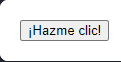
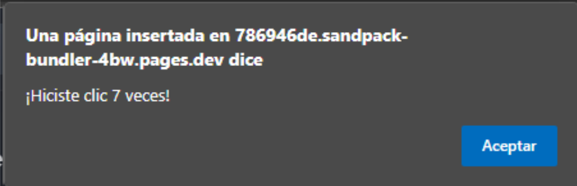

<div align='center'>
  
  <h1>Resumen y detalles de documentación React</h1>

  <sup>Deja tu :star: si te gusta el proyecto.</sup>

</div>

# **Índice**

- [**Índice**](#índice)
  - [**¿Qué es React?**](#qué-es-react)
  - [**Pensar en React** https://es.react.dev/learn/thinking-in-react](#pensar-en-react-httpsesreactdevlearnthinking-in-react)
  - [**Renderizado y confirmación**](#renderizado-y-confirmación)
  - [**El estado: la memoria de un componente**](#el-estado-la-memoria-de-un-componente)
  - [**Hooks**](#hooks)
  - [**useRef**](#useref)
  


## **¿Qué es React?**
**React** es una biblioteca de JavaScript desarrollada por Facebook para construir interfaces de usuario, principalmente en aplicaciones web de una sola página (SPA, Single Page Applications). Está enfocada en crear componentes reutilizables que se pueden combinar para construir interfaces complejas de forma eficiente. React se destaca por su rapidez, modularidad y un enfoque declarativo que facilita la creación y mantenimiento de interfaces de usuario dinámicas y reactivas.

Aquí tienes un resumen de los conceptos clave en React:

1. **Componentes**
   
- React organiza las aplicaciones en componentes, que son bloques de construcción independientes y reutilizables.
  
- Cada componente representa una parte de la interfaz de usuario (como un botón, un formulario o un encabezado) y puede tener su propia lógica y estilo.
  
- Los componentes pueden anidarse y combinarse para construir interfaces más complejas.

Ejemplo básico de un componente en React:


```js
function Bienvenida(props) { //un componente es una función 👀
  return <h1>Hola, {props.nombre}</h1>;
}
```  

1. **JSX (JavaScript XML)**
   
- React utiliza JSX, una extensión de JavaScript que permite escribir HTML directamente en el código JavaScript.
  
- Aunque JSX se parece a HTML, permite integrar lógica de JavaScript fácilmente, lo que hace que la interfaz sea más declarativa y expresiva.
```js
const elemento = <h1>¡Hola, mundo!</h1>;
```

3. **Virtual DOM**  
- React utiliza un DOM Virtual (Virtual DOM) para actualizar la interfaz de usuario de forma eficiente.
  
- En lugar de modificar el DOM real (que es lento), React crea una copia virtual del DOM en memoria. Cuando el estado de la aplicación cambia, React compara el Virtual DOM con el DOM real y actualiza solo las partes que cambiaron.
  
- Este proceso se llama reconciliación y permite que React sea rápido incluso en aplicaciones complejas.  
  

4. **Estado y Propiedades (Props)**  
- **Props**: Son los datos que los componentes reciben de otros componentes. Los props son inmutables, lo que significa que no se pueden modificar dentro del componente que los recibe.
  
- **Estado (State)**: Es un objeto que guarda datos internos del componente. A diferencia de los props, el estado es mutable y controlado dentro del componente. Cuando el estado cambia, el componente se vuelve a renderizar para reflejar los cambios.

Ejemplo de uso de estado en un componente funcional usando **useState**:

```js
import React, { useState } from 'react';

function Contador() {
  const [contador, setContador] = useState(0);

  return (
    <div>
      <p>Contador: {contador}</p>
      <button onClick={() => setContador(contador + 1)}>
        Incrementar
      </button>
    </div>
  );
}
```

5. **Hooks**  
- Los Hooks son funciones que permiten usar el estado y otras características de React en componentes funcionales).

- El hook más común es **useState** para manejar el estado, pero también hay otros como **useEffect** (para efectos secundarios) y **useContext** (para el contexto global de la aplicación).


6. **Unidirectional Data Flow (Flujo de datos unidireccional)**  
- En React, los datos fluyen en una única dirección, de los componentes padres a los componentes hijos. Esto hace que sea más fácil controlar el estado de la aplicación y depurar el flujo de datos.
  
- Si un componente necesita modificar algún dato, lo hace a través de su propio estado o utilizando funciones pasadas como props desde el componente padre.

**[⬆ Volver a índice](#índice)**

---

## **Pensar en React** https://es.react.dev/learn/thinking-in-react
1. Primero la separarás en piezas denominadas componentes.
2. Luego, describirás los diferentes estados visuales para cada uno de tus componentes.
3. Para finalizar, conectarás tus componentes de forma tal que los datos fluyan por ellos.

<u>**Paso 1: Separa la UI en una jerarquía de componentes**</u>
- Dibuja cuadros alrededor de cada componente y subcomponente en el boceto y nómbralos.


1. **FilterableProductTable** (gris) contiene toda la aplicación.
2. **SearchBar** (azul) recibe la entrada del usuario.
3. **ProductTable** (lavanda) muestra y filtra la lista de acuerdo a la entrada del usuario.
4. **ProductCategoryRow** (verde) muestra un encabezado para cada categoría.
5. **ProductRow** (amarillo) muestra una fila para cada producto.

Ahora que has identificado los componentes en el boceto, ordénalos en una jerarquía:

- FilterableProductTable  
    - SearchBar  
    - ProductTable  
      - ProductCategoryRow  
      - ProductRow

<u>**Paso 2: Construye una versión estática en React**</u>  

El enfoque más sencillo consiste en construir una versión que renderiza la UI a partir de tu modelo de datos sin añadir ninguna interactividad

Para construir la versión estática de tu aplicación que renderiza tu modelo de datos querrás construir ``componentes`` que reutilicen otros componentes y pasen datos usando ``props``.

No utilices nada de estado para construir esta versión estática. El estado se reserva solo para la interactividad, o sea, datos que cambian con el tiempo.

Puedes mockear la estructura json de los datos y pasarlos cómo props.

<u>**Paso 3: Encuentra la representación mínima pero completa del estado de la UI**</u>

**Estado:** <span style="color:yellow;">Conjunto mínimo de datos <u>cambiantes</u> que la aplicación necesita recordar.</span>

Encuentra la representación absolutamente mínima del estado que tu aplicación necesita y calcula lo demás bajo demanda.

¿Cuáles son estado? Identifica los que no lo son:

- ¿Se mantiene sin cambios con el tiempo? Si es así, <span style="color:yellow;">No es estado.</span>
- ¿Se pasa desde un padre por props? Si es así, <span style="color:yellow;">No es estado.</span>.
- ¿Puedes calcularlo basado en estado existente on en props en tu componente? Si es así, <span style="color:yellow;">¡definitivamente No es estado!</span>

<u>**Paso 4: Identificar dónde debe vivir tu estado**</u>  

Por cada pieza de estado en tu aplicación:

1. Identifica cada componente que renderiza algo basado en ese estado.
2. Encuentra su componente padre común más cercano, un componente que esté encima de todos en la jerarquía
3. Decide dónde debe residir el estado:
   1. A menudo, puedes poner el estado directamente en su padre común.
   2. También puedes poner el estado en algún componente encima de su padre común.
   3. Si no puedes encontrar un componente donde tiene sentido poseer el estado, crea un nuevo componente solo para almacenar ese estado y añádelo en algún lugar de la jerarquía encima del componente padre común.
   

Ahora utilicemos nuestra estrategia para este estado:

1. **Identifica componentes que usen estado**:
   - **ProductTable** necesita filtrar la lista de productos con base en ese estado (texto de búsqueda y valor del checkbox).
   - **SearchBar** necesita mostrar ese estado (texto de búsqueda y valor del checkbox).
2. **Encuentra su padre común**: El primer componente padre que ambos componentes comparten es FilterableProductTable.
3. **Decide donde reside el estado**: Mantendremos el texto de filtrado y el estado de valor seleccionado en FilterableProductTable.

Por tanto los valores del estado residirán en **FilterableProductTable**.

<u>**Paso 5: Añade flujo de datos inverso**</u>

Para cambiar el estado de acuerdo a la entrada del usuario necesitarás ser capaz de manejar datos fluyendo en la otra dirección: los componentes de formulario que se encuentran debajo en la jerarquía necesitan actualizar el estado en **FilterableProductTable**. Hay que <u>modificar los datos del padre desde los hijos</u>.  

El estado lo posee ``FilterableProductTable``, por lo que solo él puede llamar a ``setFilterText`` y ``setInStockOnly``. Para permitir que ``SearchBar`` actualice el estado de ``FilterableProductTable`` necesitas pasar estas funciones para abajo hacia ``SearchBar``:

```js
function FilterableProductTable({ products }) {
  const [filterText, setFilterText] = useState('');
  const [inStockOnly, setInStockOnly] = useState(false);

  return (
    <div>
      <SearchBar 
        filterText={filterText} 
        inStockOnly={inStockOnly}
        onFilterTextChange={setFilterText}
        onInStockOnlyChange={setInStockOnly} />
```

Dentro de ``SearchBar``, añadirás el controlador de evento ``onChange`` y modificarás el estado del padre desde allí:
```js
function SearchBar({
  filterText,
  inStockOnly,
  onFilterTextChange,
  onInStockOnlyChange
}) {
  return (
    <form>
      <input
        type="text"
        value={filterText}
        placeholder="Search..."
        onChange={(e) => onFilterTextChange(e.target.value)}
      />
      <label>
        <input
          type="checkbox"
          checked={inStockOnly}
          onChange={(e) => onInStockOnlyChange(e.target.checked)}
```


 


**[⬆ Volver a índice](#índice)**

---

## **Renderizado y confirmación**
El proceso de solicitud y servicio de UI tiene tres pasos:
1. **Desencadenamiento** de un renderizado (entrega del pedido del cliente a la cocina)
2. **Renderizado del componente** (preparación del pedido en la cocina)
3. **Confirmación** con el DOM (poner el pedido sobre la mesa)
   

<u>**Paso 1: Desencadenar un renderizado**</u>  
Hay  <span style="color:yellow;">dos razones por las que un componente debe ser renderizado:</span>

1. Es el **renderizado inicial** del componente.
2. El estado del componente (o de uno de sus ancestros) **ha sido actualizado**.
   

<u>**Paso 2: React renderiza tus componentes**</u> 
Después de activar un renderizado, React llama a tus componentes para averiguar qué mostrar en la pantalla. **Un «renderizado» consiste en que React haga una llamada a tus componentes.**

- En el **renderizado inicial**, React llamará al componente raíz.
- **Para los siguientes renderizados**, React llamará al componente de función cuya actualización de estado desencadenó el renderizado.

Este proceso es recursivo: si el componente actualizado devuelve algún otro componente, React renderizará ese componente a continuación, y si ese componente también devuelve algo, renderizará ese componente a continuación, y así sucesivamente. El proceso continuará hasta que no haya más componentes anidados y React sepa exactamente qué debe mostrarse en pantalla.

- **Durante el renderizado inicial**, React creará los nodos del DOM para las etiquetas ``<html>``> que tenga el documento.
- **Durante un rerenderizado**, React calculará cuáles de sus propiedades, si es que hay alguna, han cambiado desde el renderizado anterior. No hará nada con esa información hasta el siguiente paso, la fase de confirmación.

El renderizado debe ser siempre un cálculo puro:

- **Misma entrada, misma salida**. Dadas las mismas entradas, un componente debería devolver siempre el mismo JSX. (Cuando alguien pide una ensalada con tomates, no debería recibir una ensalada con cebollas).
- **Se ocupa de sus propios asuntos**. No debería cambiar ningún objeto o variable que existiera antes del renderizado. (Una orden no debe cambiar la orden de nadie más).
  
De lo contrario, puedes encontrarte con errores confusos y un comportamiento impredecible a medida que tu base de código crece en complejidad. Cuando se desarrolla en «Modo estricto», React llama dos veces a la función de cada componente, lo que puede ayudar a aflorar los errores causados por funciones impuras.

<u>**Paso 3: React confirma los cambios en el DOM**</u>

Después de renderizar (llamar) tus componentes, React modificará el DOM.

- **Para el renderizado inicial**, React utilizará la API del DOM ``appendChild()`` para poner en pantalla todos los nodos del DOM que ha creado.
- **Para los rerenderizados**, React aplicará las operaciones mínimas necesarias (¡calculadas durante el renderizado!) para hacer que el DOM coincida con la última salida del renderizado.
React sólo cambia los nodos del DOM si hay una diferencia entre los renderizados.

Después de que el renderizado haya terminado y React haya actualizado el DOM, el navegador volverá a pintar la pantalla.


**[⬆ Volver a índice](#índice)**

---
## **El estado: la memoria de un componente**
Los componentes a menudo necesitan cambiar lo que se muestra en pantalla como resultado de una interacción: Texto de un formulario, imágenes de un carrusell, lementos de un carrito de compra...  Los ejemplos anteriores los componentes deben «recordar» cosas: el campo de texto, la imagen actual, el carrito de compras. En React, a este tipo de memoria de los componentes se le conoce como **estado**.

1. **Las variables locales no persisten entre renderizaciones**. Cuando React renderiza este componente por segunda vez, lo hace desde cero, no considera ningún cambio en las variables locales.
2. L**os cambios en las variables locales no activarán renderizaciones**. React no se da cuenta de que necesita renderizar el componente nuevamente con los nuevos datos.  
   
Para actualizar un componente con datos nuevos, deben pasar las siguientes dos cosas:

1. **Conservar** los datos entre renderizaciones.
2. **Provocar** que React renderice el componente con nuevos datos (re-renderizado).

El Hook de ``useState`` ofrece dos cosas:

1. Una **variable de estado** para mantener los datos entre renderizados.
2. Una **función que setea el estado** para actualizar la variable y provocar que React renderice el componente nuevamente.
```js
const [index, setIndex] = useState(0);
```
``index`` es una variable de estado y ``setIndex`` es la función que setea el estado.

Los Hooks son funciones especiales que sólo están disponibles mientras React está renderizando.

**Anatomía del useState**
Cuando llamamos al ``useState``, le estamos diciendo a React que debe recordar algo:
```js
const [index, setIndex] = useState(0);
```
En este caso, queremos que React recuerde el ``index``.

Cada vez que el componente se renderiza, el ``useState`` devuelve un array que contiene dos valores:

1. La **variable de estado** (``index``) con el valor que almacenaste.
2. La **función que establece el estado** (``setIndex``) que puede actualizar la variable de estado y alertar a React para que renderice el componente nuevamente.

Así es como sucede en acción:

1. **Tu componente se renderiza por primera vez**. Debido a que pasamos 0 a useState como valor inicial para ``index``, esto devolverá ``[0, setIndex]``. React recuerda que ``0`` es el último valor de estado.
2. **Actualizas el estado**. Cuando un usuario hace clic en el botón, llama a ``setIndex(index + 1)``. ``index`` es ``0``, por lo tanto es ``setIndex(1)``. Esto le dice a React que recuerde que ``index`` es ``1`` ahora y ejecuta otro renderizado.
3. **El componente se renderiza por segunda vez**. React todavía ve ``useState(0)``, pero debido a que React recuerda que estableció ``index`` en ``1``, devuelve ``[1, setIndex]`` en su lugar.
4. ¡Y así sucesivamente!

Es una buena idea tener múltiples variables de estado si no se encuentran relacionadas entre sí. Pero si encontramos que a menudo cambiamos dos variables de estado juntas, podría ser mejor combinarlas en una sola. Por ejemplo, si tenemos un formulario con muchos campos, es más conveniente tener una única variable de estado que contenga un objeto que una variable de estado por campo.

**El estado es aislado y privado.** 
El estado es local para una instancia de un componente en la pantalla. En otras palabras, **si renderizas el mismo componente dos veces, ¡cada copia tendrá un estado completamente aislado!** Cambiar uno de ellos no afectará al otro.

A diferencia de las props, **el estado es totalmente privado para el componente que lo declara**. El componente padre no puede cambiarlo. Esto permite agregar el estado a cualquier componente o eliminarlo sin afectar al resto de los componentes.

¿Qué pasaría si quisieramos que ambas galerías mantuvieran sus estados sincronizados? La forma correcta de hacerlo en React es eliminar el estado de los componentes secundarios y agregarlo a su padre más cercano.

**[⬆ Volver a índice](#índice)**

---

## **Hooks**

## **useRef**
``useRef`` es un Hook de React que te permite referenciar un valor que no es necesario para el renderizado.
```js
const ref = useRef(initialValue)
```

Llama a useRef en el nivel superior de tu componente para declarar una ref.
```js
import { useRef } from 'react';

function MyComponent() {
  const intervalRef = useRef(0);
  const inputRef = useRef(null);
  // ...
```

- ``initialValue``: El valor que quieres que tenga inicialmente la propiedad ``current`` del objeto ref. Puede ser un valor de cualquier tipo. Este argumento se ignora después del renderizado inicial.

``useRef`` devuelve un objeto con una sola propiedad:
- ``current``: Inicialmente, se establece en el initialValue que has pasado. Más tarde puedes establecerlo a otra cosa. Si pasas el objeto ref a React como un atributo ref a un nodo JSX, React establecerá su propiedad current.

En los siguientes renderizados, ``useRef`` devolverá el mismo objeto.

**<span style="color:red; ">Advertencias:</span>**

- Puedes mutar la propiedad ``ref.current``. A diferencia del estado, es mutable. Sin embargo, si contiene un objeto que se utiliza para el renderizado (por ejemplo, una parte de tu estado), entonces no deberías mutar ese objeto.
- Cuando cambias la propiedad ``ref.current``, React no vuelve a renderizar tu componente. React no está al tanto de cuándo la cambias porque una ref es un objeto JavaScript plano.
- No escribas ni leas ``ref.current`` durante el renderizado, excepto para la inicialización. Esto hace que el comportamiento de tu componente sea impredecible.
- En el modo estricto, React **llamará a la función de tu componente dos veces** para ayudarte a encontrar impurezas accidentales. Este es un comportamiento solo de desarrollo y no afecta en producción. Esto significa que cada objeto ref se creará dos veces, y una de las versiones se descartará. Si la función de tu componente es pura (como debería ser), no debería afectar a la lógica de tu componente.

**Uso**
- **Referenciar un valor con una ref**
  ```js
  import { useRef } from 'react';

  function Stopwatch() {
  const intervalRef = useRef(0);
  // ...
  ```

  ``useRef`` devuelve un objeto ref con una sola  propiedad current  establecida inicialmente con el valor inicial que proporcionaste. ``const intervaRef = {current: 0}``

  En los siguientes renderizados, ``useRef`` devolverá el mismo objeto. Puedes cambiar su propiedad current para almacenar información y leerla más tarde.

  La diferencia con el estado de ``useState`` es que **el cambio de una ref no provoca un nuevo renderizado**. Esto significa que las refs son perfectas para almacenar información que no afecta a la salida visual de tu componente. Por ejemplo, si necesita almacenar un ID de intervalo y recuperarlo más tarde, puedes ponerlo en una ref. Para actualizar el valor dentro de la ref, es necesario cambiar manualmente ``supropiedad current``

  **Al utilizar una ref, te aseguras de que:**

- Puedes **almacenar información entre renderizados** (a diferencia de las variables regulares, que se reinician en cada renderizado).
- **Si se cambia no se desencadena un renderizado** (a diferencia de las variables de estado, que desencadenan un renderizado).
- **La información es local para cada copia de tu componente** (a diferencia de las variables externas, que son compartidas).  
  
El cambio de una ref no desencadena un renderizado, por lo que las refs no son apropiadas para almacenar información que se quiere mostrar en la pantalla.

**Ejemplo**
```js
import { useRef } from 'react';

export default function Counter() {
  let ref = useRef(0);

  function handleClick() {
    ref.current = ref.current + 1;
    alert('¡Hiciste clic ' + ref.current + ' veces!');
  }

  return (
    <button onClick={handleClick}>
      ¡Hazme clic!
    </button>
  );
}
```
Este componente utiliza una ref para llevar la cuenta de las veces que hiciste clic en el botón. Ten en cuenta que está bien usar una ref en lugar de un estado aquí porque el recuento de clics sólo se lee y se escribe en un **controlador de evento.**





**<span style="color:red;">Atención:</span>**   
**No escribas ni leas ``ref.current`` durante el renderizado.**
```js
function MyComponent() {
  // ...
  // 🚩 No escribas una ref durante el renderizado
  myRef.current = 123;
  // ...
  // 🚩 No leas una ref durante el renderizado
  return <h1>{myOtherRef.current}</h1>;
}
```
Puedes, en su lugar, leer o escribir refs **desde controladores de eventos o efectos**.
```js
function MyComponent() {
  // ...
  useEffect(() => {
    // ✅ Se pueden leer o escribir refs en efectos
    myRef.current = 123;
  });
  // ...
  function handleClick() {
    // ✅ Puedes leer o escribir refs en los controladores de eventos
    doSomething(myOtherRef.current);
  }
  // ...
}
```
Si tienes que leer o escribir algo durante el renderizado, utiliza el estado en su lugar.

**Manipulación del DOM con una ref**

En primer lugar, declara una ``objeto ref`` con un ``valor inicial de null``:

```js
import { useRef } from 'react';

function MyComponent() {
  const inputRef = useRef(null);
  // ...
```
Luego pasa tu objeto ref como el atributo ``ref`` al JSX del nodo DOM que quieres manipular:
```js
 return <input ref={inputRef} />;
```
Después de que React cree el nodo DOM y lo ponga en la pantalla, React establecerá la ``propiedad current`` de tu objeto ref a ese nodo DOM. Ahora puedes acceder al nodo DOM de ``<input>`` y llamar a métodos como ``focus()``:

```js
  function handleClick() {
    inputRef.current.focus();
  }
```
React establecerá la propiedad ``current`` a ``null`` cuando el nodo sea eliminado de la pantalla.

**Exponer una ref a tu propio componente**
Me he quedado aquí. Es el ejercicio 4 para ver el uso de ``forwardRef``


https://es.react.dev/reference/react/useRef


**[⬆ Volver a índice](#índice)**

---

Referenciar valores con ref: https://es.react.dev/learn/referencing-values-with-refs#differences-between-refs-and-state  
Componentes Puros: https://es.react.dev/learn/keeping-components-pure  
Optomizando el rendimiento: https://es.legacy.reactjs.org/docs/optimizing-performance.html  
Elección de la estructura del estado: https://es.react.dev/learn/choosing-the-state-structure  
React Hooks: No es magia, sólo son Arrays.: https://medium.com/@ryardley/react-hooks-not-magic-just-arrays-cd4f1857236e  
Compartir estado entre componentes: https://es.react.dev/learn/sharing-state-between-components 
Lee más sobre la manipulación del DOM con refs: https://es.react.dev/learn/manipulating-the-dom-with-refs
forwardRef: le permite a tu componente exponer un nodo DOM al componente padre con una ref: https://es.react.dev/reference/react/forwardRef  
Manipular el DOM con Refs: https://es.react.dev/learn/manipulating-the-dom-with-refs#accessing-another-components-dom-nodes


