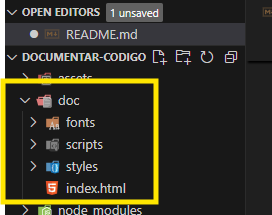
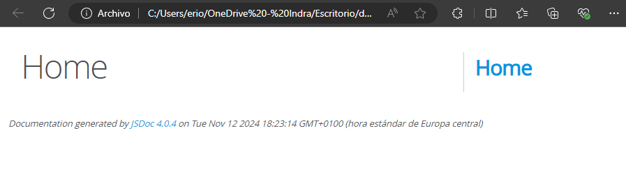
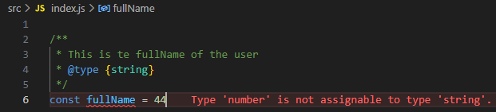

<div align='center'>
 <a style="font-size: 34px;" href="https://jsdoc.app/" >@use JSDoc</a>
  <h1>Documentar código JSDoc</h1>
  <sup>Deja tu :star: si te gusta el proyecto.</sup>
  <div align='left'>
<a href="https://jsdoc.app/" target="_blank" rel="noopener noreferrer">Visita documentación</a>

## **Índice**

- [**Índice**](#índice)
    - [**Configuración**](#configuración)
    - [**Puesta en marcha**](#puesta-en-marcha)
    - [**Primera documentación**](#primera-documentación)
    - [**Típado estático**](#típado-estático)
    - [**Documentar arrays**](#documentar-arrays)
    - [**Documentar objetos**](#documentar-objetos)
    - [**Documentar funciones**](#documentar-funciones)
    - [**Custom Types**](#custom-types)

Documentar arrays


#### **Configuración**
- Creamos el archivo package.json:
  ```js
  npm init -y
  ```
- Instalamos:
  ```js
  npm i jsdoc
  ```
- Creamos el archivo de configuración de jsdoc:  `jsdoc.json`  
  - Documentación: https://jsdoc.app/about-configuring-jsdoc
  ```js
    {
    "plugins":[],
    "source": {
        "include": ["src"],
        "includePattern": ".js$",
        "excludePattern": "(node_modules|docs)"
    },
    "templates": {
        "cleverLinks": "false",
        "monospaceLinks": "false"

    },
    "opts": {
        "recurse": "true",
        "destination": "./doc"
    }
  }
  ```
  - **plugins**: Para extender la funcionalidad básica de jsdoc
  - **source**: Describe desde donde va a leer los archivos: El código fuente está en **src**.
  - **includePattern**: Qué archivos tiene que leer. En este caso lee todos los archivos que acaban en **.js**
  - **excludePattern**: Carpetas excluidas.
  - **templates**: Qué es lo que va a estar generando la documentación. Detalles de los enlaces que va a generar dentro de documentación, hacia dónde van a apuntar o qué formato quiero que tengan.
    - **cleverLinks**:  Para que genere enlaces dentro de la documentación
  - **opts**:
    - **recurse**: Para leer carpetas y archivos de forma recursiva. Unos dentro de otros.
    - **destination**: Dónde se guardarán los archivos. 

**[⬆ Volver a índice](#índice)**

---
#### **Puesta en marcha**
- Para ponerlo enmarcha hay que ejecutar el comando **jsdoc -c** más el archivo de configuración.
```js
jsdoc -c jsdoc.json
```
Este comando dará un error porque está instalado localmente. Para ejecutarlo necesito utilizar el comando **npx** Este comando busca el el package.json si está instalada la dependencia localmente. Entoces lo podrá ejecutar.
```js
npx jsdoc -c jsdoc.json
```
Este comando ha generado la carpeta **doc** con una página con una página html :  
  
  

Este archivo se autogenerará cada vez que ejecutemos el comando.

Para no tener que recordar el comando, podemos hacer un script en el package.json
```js
 "scripts": {
    "doc": "jsdoc -c jsdoc.json"
  },

  npm run doc // Esto ya ejecutaría el comando
```
**[⬆ Volver a índice](#índice)**

---
#### **Primera documentación**
- **Cómo agregar comentarios de documentación a su código**
  - Los comentarios de JSDoc generalmente deben colocarse inmediatamente antes del código que se está documentando. Cada comentario debe comenzar con una secuencia `/**` para que el analizador de JSDoc lo reconozca. Los comentarios que comiencen con `/*`, `/***`o más de 3 estrellas serán ignorados.
  - La documentación más simple es solo una descripción
  ```js
  /** This is a description of the foo function. */
    function foo() {
    }
  ```
  - Se pueden utilizar más etiquetas para agregar más información.
  ```js
  /**
   * This is te fullName of the user
   * @type {string}
  */
  const fullName = "Ryan Ray"

  ```
  #### **Típado estático**
  Podemos activar una característica de VS Code que nos avise si el tipo de la documentación no coincide con que hemos inicializado la variable. Para ello hace uso de Tipecript: `//@ts-check`  
  También nos dará el autocompletado.
  ```js
  //@ts-check
  /**
   * This is te fullName of the user
   * @type {string}
   */
  const fullName = 44 //Marcará esto como error al no ser un string
  ```
  Si no queremos utiizar el comentario `//@ts-check` en el código.pode,os utilizar el **workspace** de VSCode, que es un archivo de configuración solo para ese proyecto.

  Podemos crear la carpeta `.vscode` y dentro el archivo de configuración `setting.json` manualmente o clicando `f1` en VSCode y buscando `workspace setting` y clicando `workspace setting (JSON)` se generá ña carpeta y el archivo de forma automática.

  Configuramos el archivo de esta manera:
  ```js
  //settings.json
  {
    "js/ts.implicitProjectConfig.checkJs": true
  }
  ```

  Ahora nos marcará en error sin tener que indicar la línea `//@ts-check`

  

  **[⬆ Volver a índice](#índice)**

---

#### **Documentar arrays**
```js
/**
 * Array of user ages
 * @type {Array<Number>}
 */
const age = [19, 22, 56, 48, 23];
```

  **[⬆ Volver a índice](#índice)**

---

#### **Documentar objetos**
```js
/**
 * Person Object
 * @type {{id: number | string, firstName: string, lastName: string, age: number  }}
 */
const person ={
    id: 1,
    firstName: "Ryan",
    lastName: "Ray",
    age: 30
}

```

  **[⬆ Volver a índice](#índice)**

---
#### **Documentar funciones**
```js
/**
 * 
 * @param {number} n1 First Number
 * @param {number} n2 Second Number
 * @returns {number} Total Result //{void} Si no retorna nada.
 */
const add = (n1, n2) => {
    return n1 + n2
}
```

  **[⬆ Volver a índice](#índice)**

---
#### **Custom Types**
```js
/**
 * A new User Object
 * @typedef {Object} User
 * @property {number} id User Id
 * @property {string} name User Name
 * @property {number | string } [age] User age (Optional)
 * @property {boolean} isActive User state
 */

/**
 * @type {User}
 */
const myNewUser = {
    id: 1,
    name: "Ryan",
    age: 30,
    isActive: true
}

```

  **[⬆ Volver a índice](#índice)**

---


https://www.youtube.com/watch?v=r0H-acWQS6c&t=1153s  
min: 51:08

